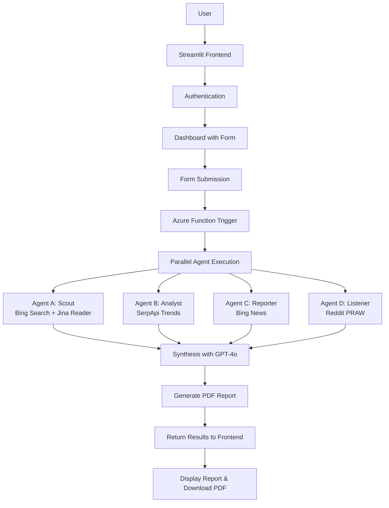

# Synapsee AI Project Plan

## Project Overview
Synapsee AI is a multi-agent system for startup market validation with user authentication, consisting of a Streamlit frontend and Azure Functions backend with 4 autonomous agents.

## User Inputs
- Product Type
- Target Region (country, city, or worldwide)
- Product Description
- Maximum Unit Price
- Target Age Group (optional dropdown)

## Outputs
- When to Market Product
- Raw Material Buying Timing
- Possible Competitors
- Feasibility (based on unit price)
- Safe Manufacturing Amount (based on region)
- Key Factors to Include
- Other Nearby Possible Target Regions

## Architecture Diagram



## Directory Structure
```
synapsee-ai/
├── README.md
├── requirements.txt
├── app.py (Streamlit frontend with auth)
├── .streamlit/
│   └── secrets.toml
├── functions/
│   ├── host.json
│   └── synapsee_function/
│       ├── function.json
│       └── __init__.py
└── src/
    ├── agents.py
    ├── synthesis.py
    ├── auth.py
    └── utils.py
```

## Authentication Details
- Use streamlit-authenticator for login/signup
- Store user credentials securely (hashed)
- Session management for logged-in users
- Dashboard access only after authentication

## Database Schema (Azure Cosmos DB)
- Users collection: {id, username, email, hashed_password, created_at}
- Reports collection: {id, user_id, product_data, analysis_results, pdf_url, created_at}

## Agent Logic Details
- **Scout (Agent A)**: Search for competitors using Bing, extract features/prices with Jina Reader
- **Analyst (Agent B)**: Fetch Google Trends data via SerpApi, analyze seasonality
- **Reporter (Agent C)**: Search Bing News for supply chain issues related to product materials
- **Listener (Agent D)**: Query Reddit subreddits for user pain points and feature requests
- **Synthesis**: Combine all data with GPT-4o to generate recommendations, including nearby regions based on region analysis

## UI Components
- Login/Signup page
- Dashboard with form: text inputs for product type, region, description, price; dropdown for age group
- Results page: display analysis in cards/charts, PDF download button
- Loading indicators during analysis

## Error Handling
- API rate limits and failures
- Invalid user inputs
- Network timeouts
- Fallback responses for missing data

## Security Considerations
- API keys stored in Azure Key Vault or environment variables
- Input validation and sanitization
- HTTPS for all communications
- User data encryption in Cosmos DB

## Implementation Steps
1. Create requirements.txt with dependencies (including streamlit-authenticator)
2. Implement authentication in Streamlit app.py
3. Create dashboard with form for inputs
4. Set up Azure Functions structure
5. Implement each agent in src/agents.py
6. Implement synthesis logic with additional output for nearby regions
7. Add PDF generation
8. Create config files
9. Add error handling and logging

## API Integrations
- Bing Web Search API
- SerpApi
- Azure OpenAI
- Reddit PRAW
- Jina Reader (via requests)
- Bing News API
- Azure Cosmos DB SDK